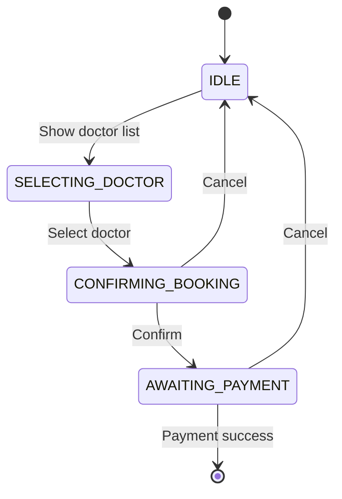
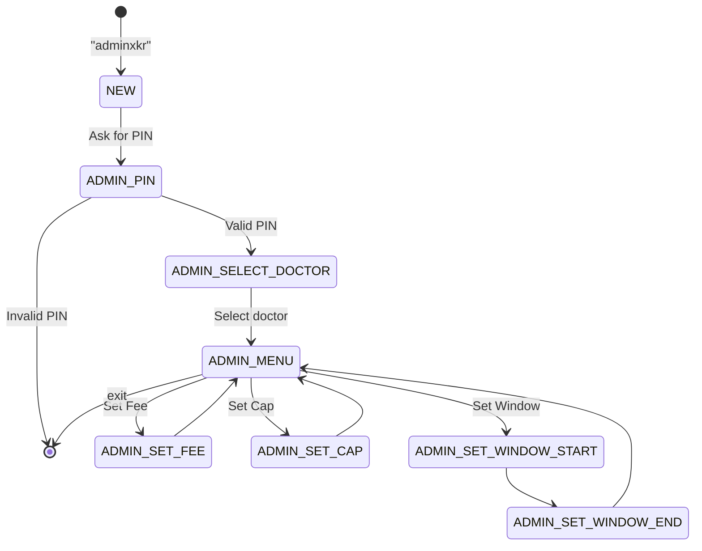
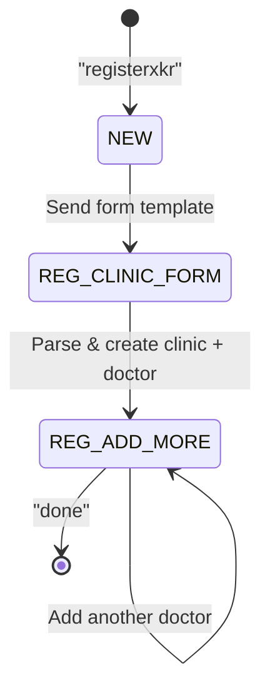

Handlers process incoming WhatsApp messages and manage conversation flows. They implement state machines to handle multi-step interactions.

## Message Router

**Location:** `src/handlers/messageRouter.js`

Routes incoming WhatsApp messages to patient or admin handlers. Uses fuzzy search for clinic/doctor discovery (scalable to 1000s of clinics).

### route

Main entry point for all incoming WhatsApp messages.

<ParamField path="phoneNumberId" type="string" required>
  Meta WhatsApp Business phone_number_id
</ParamField>

<ParamField path="from" type="string" required>
  Sender's phone number (E.164 format, e.g., `919876543210`)
</ParamField>

<ParamField path="messageId" type="string" required>
  WhatsApp message ID
</ParamField>

<ParamField path="messageBody" type="string">
  Text message body
</ParamField>

<ParamField path="messageType" type="string">
  Message type: `text`, `interactive`, etc.
</ParamField>

<ParamField path="interactiveData" type="object">
  Interactive message data (list_reply, button_reply)
</ParamField>

<CodeGroup>
```javascript Webhook Handler
const messageRouter = require('./handlers/messageRouter');

app.post('/webhook', async (req, res) => {
  const { entry } = req.body;
  
  for (const change of entry[0].changes) {
    const { messages } = change.value;
    
    for (const message of messages || []) {
      await messageRouter.route(
        change.value.metadata.phone_number_id,
        message.from,
        message.id,
        message.text?.body,
        message.type,
        message.interactive
      );
    }
  }
  
  res.sendStatus(200);
});
```
</CodeGroup>

### Routing Logic

The router follows this decision tree:

<Steps>
  <Step title="Check for special commands">
    - `=?cmdxkr` → Show command list
    - `settlementsxkr` (owner only) → Show settlement report
    - `registerxkr` → Start clinic registration
    - `APPROVE [id]` (owner only) → Approve clinic
    - `SETTLED [id]` (owner only) → Mark bookings as settled
    - `listxkr` (owner only) → List all clinics and doctors
    - `DELDOC [id]` (owner only) → Delete doctor
    - `DELCLINIC [id]` (owner only) → Deactivate clinic
  </Step>
  
  <Step title="Check registration state">
    If user is mid-registration flow (`REG_*` states), route to `registrationHandler`
  </Step>
  
  <Step title="Check admin trigger">
    If message is `adminxkr`, route to `adminHandler`
  </Step>
  
  <Step title="Check admin state">
    If user is in admin flow (`ADMIN_*` states), route to `adminHandler`
  </Step>
  
  <Step title="Global commands">
    - `status` / `my bookings` → Show platform-level bookings
    - `hi` / `hello` / `hey` / `start` → Reset and show search prompt
  </Step>
  
  <Step title="Check clinic selection">
    If user has selected a clinic, route to `patientHandler`
  </Step>
  
  <Step title="Default: Search flow">
    Handle search-based clinic/doctor discovery
  </Step>
</Steps>

### showSearchPrompt

Display the search/discovery interface with top doctors and specializations.

<ParamField path="phoneNumberId" type="string" required>
  WhatsApp phone_number_id
</ParamField>

<ParamField path="accessToken" type="string" required>
  WhatsApp access token
</ParamField>

<ParamField path="from" type="string" required>
  User phone number
</ParamField>

**Sends:** WhatsApp interactive list with:
- Section 1: Browse by Specialization
- Section 2: All Doctors (top 10)

### handleSearch

Handle search-based discovery when user types a clinic or doctor name.

**Search Behavior:**
- If exactly 1 doctor match and 0 clinic matches → Go directly to booking
- If exactly 1 clinic match and 0 doctor matches → Show clinic's doctor list
- If multiple matches → Show interactive list of results (max 10)
- If no matches → Ask user to check spelling

<CodeGroup>
```javascript Search Flow Example
// User types: "cardio"
// Router calls searchService.search('cardio')
// Returns: 2 clinics, 3 doctors
// Sends WhatsApp list with 5 results
// User selects "Dr. Sharma (Cardiologist)"
// Router → patientHandler.handleDoctorSelection()
```
</CodeGroup>

### showPlatformBookings

Show ALL of a patient's bookings across all clinics (platform-level).

### showSettlements

Show unsettled amounts per clinic (owner only). Displays:
- Clinic name and booking count
- Per-doctor breakdown
- Amount owed to clinic
- Platform fee earned
- Instructions to mark as settled

---

## Patient Handler

**Location:** `src/handlers/patientHandler.js`

Handles the patient-side WhatsApp conversation flow.

### State Machine



### handle

Main entry point for patient messages.

<ParamField path="clinic" type="object" required>
  Clinic object with `id`, `phone_number_id`, `access_token`, `timezone`, etc.
</ParamField>

<ParamField path="from" type="string" required>
  Patient phone number
</ParamField>

<ParamField path="messageBody" type="string">
  Message text
</ParamField>

<ParamField path="messageType" type="string">
  Message type
</ParamField>

<ParamField path="interactiveData" type="object">
  Interactive message data
</ParamField>

### handleIdle

Handle IDLE state — show clinic profile card + doctor list.

**Sends:**
1. Rich text card with:
   - Clinic name and address (with Google Maps link)
   - Contact phone
   - List of doctors with specializations, fees, hours, and working days
2. Interactive list to select a doctor

<CodeGroup>
```text Example Output
🏥 City Care Clinic
📍 123 Main Road, Kharagpur
https://maps.google.com/?q=123+Main+Road%2C+Kharagpur
📞 9876543210

Doctors

🩺 Dr. Rahul Sharma · General Physician
💰 ₹300 · ⏰ 09:00 – 17:00 · Mon,Tue,Wed,Thu,Fri,Sat

🩺 Dr. Priya Patel · Cardiologist
💰 ₹500 · ⏰ 10:00 – 18:00 · Everyday
```
</CodeGroup>

### handleDoctorSelection

Handle doctor selection → validate availability → show confirmation.

**Validation steps:**
1. Check doctor exists and belongs to clinic
2. Get doctor config
3. Check clinic is active
4. Check booking window (time-based)
5. Check working days
6. Get or create daily state
7. Check status (OPEN / PAUSED / CLOSED)
8. Check capacity (current_count < max_patients)

**If all checks pass:**
- Sends confirmation message with buttons (Confirm / Cancel)
- Shows: clinic name, doctor name, date, fee, slots left
- Transitions to `CONFIRMING_BOOKING` state

**If validation fails:**
- Sends error message explaining why
- Resets to IDLE

### confirmBooking

Confirm booking → create order → send payment link.

**Flow:**
1. Create Razorpay payment link via `orderService.createOrder()`
2. Create UPI QR code via `orderService.createUpiQr()`
3. Send QR code image + payment link via WhatsApp
4. Transition to `AWAITING_PAYMENT` state

<CodeGroup>
```text Payment Message Example
Payment

Dr. Rahul Sharma
Amount: ₹300
Date: 2026-03-04

Tap to pay or scan QR:
https://rzp.io/l/abc123

Expires in 10 minutes.
Type cancel to abort.

[QR Code Image]
```
</CodeGroup>

### showMyBookings

Show patient's bookings for today at this clinic.

### cancelPendingPayment

Cancel a pending payment — expire order, cancel Razorpay link + QR, and reset.

---

## Admin Handler

**Location:** `src/handlers/adminHandler.js`

Handles admin-side WhatsApp commands after PIN authentication.

### State Machine



### isAdminTrigger

Check if message is the admin command.

<ParamField path="text" type="string" required>
  Message text
</ParamField>

<ResponseField name="return" type="boolean">
  True if text is `adminxkr` (case-insensitive)
</ResponseField>

### handle

Main entry point for admin messages.

<ParamField path="clinic" type="object" required>
  Clinic object
</ParamField>

<ParamField path="from" type="string" required>
  Admin phone number
</ParamField>

<ParamField path="messageBody" type="string">
  Message text
</ParamField>

<ParamField path="messageType" type="string">
  Message type
</ParamField>

<ParamField path="interactiveData" type="object">
  Interactive data
</ParamField>

<ParamField path="convoState" type="object" required>
  Current conversation state
</ParamField>

### startLogin

Start admin login flow — ask for PIN.

### handlePinEntry

Validate PIN and create admin session.

**Success:**
- Creates 10-minute session via `adminService.login()`
- Shows admin menu

**Failure:**
- Sends error message
- Resets conversation

### showAdminMenu

Show doctor selection menu.

**Sends:** Interactive list with all clinic doctors

### showDoctorActions

Show available actions for a selected doctor.

**Actions:**
- 💰 Set Fee
- 👥 Set Cap
- ⏰ Set Booking Window
- ⏸ Pause Bookings
- ▶️ Resume Bookings
- 🔒 Close Bookings
- 📋 View Today's Bookings
- 💵 View Earnings

**Also shows current config:**
- Current fee, cap, window, working days
- Today's count and status

### executeAction

Execute the selected admin action.

<ParamField path="clinic" type="object" required>
  Clinic object
</ParamField>

<ParamField path="from" type="string" required>
  Admin phone
</ParamField>

<ParamField path="action" type="string" required>
  Action name: `fee`, `cap`, `window`, `pause`, `resume`, `close`, `view`, `earnings`
</ParamField>

<ParamField path="doctorId" type="UUID" required>
  Doctor ID
</ParamField>

### handleSetFee

Handle fee input from admin.

**Validation:**
- Must be a positive integer
- Converts rupees to paise (multiplies by 100)
- Updates via `doctorService.updateConfig()`

### handleSetCap

Handle daily cap input.

**Validation:**
- Must be a positive integer
- Updates `max_patients` config

### handleSetWindowStart / handleSetWindowEnd

Handle booking window time inputs.

**Format:** `HH:MM` (e.g., `06:00`, `22:00`)

**Process:**
1. Ask for start time
2. Validate format
3. Ask for end time
4. Validate format
5. Update both `booking_start_time` and `booking_end_time`

### viewTodayBookings

Show all bookings for a doctor today.

**Format:**
```text
📋 Today's Bookings — Dr. Sharma
📅 2026-03-04

1 | 9876***210 | ₹300
2 | 9123***456 | ₹300
3 | 9999***888 | ₹300

📊 Total: 3 bookings
```

### viewEarnings

Show earnings summary for the clinic.

**Displays:**
- Today's earnings (bookings, collected, clinic share, platform fee)
- Total unsettled earnings

---

## Registration Handler

**Location:** `src/handlers/registrationHandler.js`

One-shot form style registration. Clinic owner types `registerxkr` → gets a form template → fills all fields → sends back in one message. Supports adding multiple doctors one at a time.

### State Machine



### isRegisterTrigger

Check if message triggers registration.

<ParamField path="text" type="string" required>
  Message text
</ParamField>

<ResponseField name="return" type="boolean">
  True if text is `registerxkr`
</ResponseField>

### handle

Main entry point — route based on state.

### startRegistration

Send the clinic + first doctor form template.

**Form fields:**
- Clinic Name
- Address
- Contact Number
- Doctor Name
- Specialization
- Fee
- Daily Cap
- Start Time
- End Time
- Working Days

<CodeGroup>
```text Form Template
🏥 Clinic Registration

Fill in the details below, then copy and send it back:
(Type exit to cancel)

━━━━━━━━━━━━━━━━━
Clinic Name:
Address:
Contact Number:
━━━━━━━━━━━━━━━━━
Doctor Name:
Specialization:
Fee:
Daily Cap:
Start Time:
End Time:
Working Days:
━━━━━━━━━━━━━━━━━

📝 Example:
Clinic Name: City Care Clinic
Address: 123 Main Road, Kharagpur
Contact Number: 9876543210
Doctor Name: Rahul Sharma
Specialization: General Physician
Fee: 300
Daily Cap: 25
Start Time: 9am
End Time: 5pm
Working Days: Mon, Tue, Wed, Thu, Fri, Sat
```
</CodeGroup>

### handleClinicForm

Parse the filled clinic + doctor form.

**Process:**
1. Parse form fields (key: value format)
2. Validate all required fields
3. Generate random 4-digit admin PIN
4. Create clinic in database (inactive by default)
5. Create first doctor + config
6. Ask if they want to add more doctors
7. Transition to `REG_ADD_MORE` state

### handleAddMore

Handle adding more doctors or finishing.

**Input:**
- `done` → Finish registration
- Doctor form → Add another doctor

### handleDoctorForm

Parse and save a doctor form submission.

**Validation:**
- All required fields
- Fee is a positive integer
- Cap is a positive integer
- Times are in valid format (supports 12h/24h)
- Working days are valid

### finishRegistration

Show summary + notify owner for approval.

**Sends to registrant:**
- Clinic summary
- All doctors added
- Admin PIN (save this!)
- "Under review" message

**Sends to BookLine owner:**
- New registration notification
- All details
- Approval command: `APPROVE [clinic_id]`

### approveClinic

Approve a clinic (called from router when owner sends `APPROVE <id>`).

**Process:**
1. Set `active = true` on clinic
2. Notify owner: "Clinic is now LIVE"
3. Notify registrant: "Approved! Welcome aboard!"

### Helper Functions

#### parseTime

Parse flexible time input into HH:MM 24h format.

**Supports:**
- `9am`, `10:30am`, `5pm` → 12-hour format
- `09:00`, `17:30` → 24-hour format
- `0900`, `1730` → Without colon

#### parseDays

Parse working days input.

**Supports:**
- `Everyday` / `daily` / `all` → "Everyday"
- `Weekdays` / `Mon-Fri` → "Mon,Tue,Wed,Thu,Fri"
- `Weekends` → "Sat,Sun"
- Custom: `Mon, Wed, Fri` → "Mon,Wed,Fri"

#### parseForm

Parse a form response into key-value pairs.

**Expected format:** Lines like `Clinic Name: XYZ` or `Fee: 300`