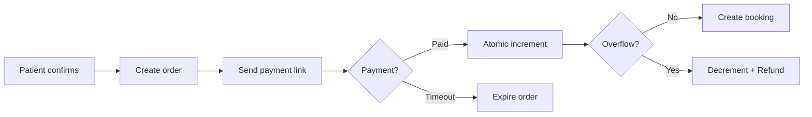
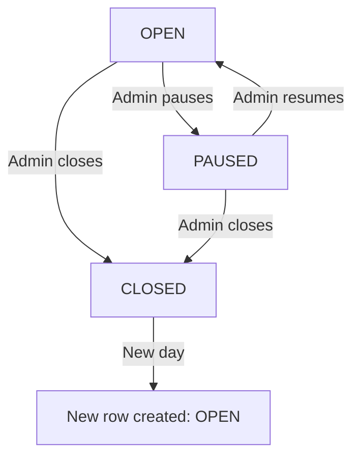

## Overview

BookLine uses **Supabase (PostgreSQL)** with 8 core tables and 3 RPC functions for atomic operations. The schema is designed for multi-clinic isolation, atomic position assignment, and idempotent payment processing.

<Note>
All tables use **UUID** primary keys generated via `uuid_generate_v4()`.
</Note>

## Tables

### 1. clinics

Represents a clinic using BookLine. Each clinic is identified by its WhatsApp `phone_number_id`.

```sql
CREATE TABLE IF NOT EXISTS clinics (
  id            UUID PRIMARY KEY DEFAULT uuid_generate_v4(),
  name          TEXT NOT NULL,
  phone_number_id TEXT NOT NULL UNIQUE,   -- Meta WhatsApp phone_number_id
  waba_id       TEXT,                      -- WhatsApp Business Account ID
  access_token  TEXT NOT NULL,             -- Per-clinic access token
  admin_pin     TEXT NOT NULL DEFAULT '1234',
  timezone      TEXT NOT NULL DEFAULT 'Asia/Kolkata',
  active        BOOLEAN NOT NULL DEFAULT TRUE,
  created_at    TIMESTAMPTZ NOT NULL DEFAULT NOW(),
  updated_at    TIMESTAMPTZ NOT NULL DEFAULT NOW()
);

CREATE UNIQUE INDEX IF NOT EXISTS idx_clinics_phone_number_id
  ON clinics (phone_number_id);
```

<Accordion title="Field Descriptions">
- **phone_number_id:** Unique identifier from WhatsApp Meta Cloud API. Used to route incoming messages to the correct clinic.
- **waba_id:** WhatsApp Business Account ID (optional).
- **access_token:** Per-clinic token for sending WhatsApp messages.
- **admin_pin:** 4-digit PIN for admin authentication (default: `1234`).
- **timezone:** Used for daily state rollover (default: `Asia/Kolkata`).
</Accordion>

---

### 2. doctors

Doctors belonging to a clinic.

```sql
CREATE TABLE IF NOT EXISTS doctors (
  id         UUID PRIMARY KEY DEFAULT uuid_generate_v4(),
  clinic_id  UUID NOT NULL REFERENCES clinics(id) ON DELETE CASCADE,
  name       TEXT NOT NULL,
  active     BOOLEAN NOT NULL DEFAULT TRUE,
  created_at TIMESTAMPTZ NOT NULL DEFAULT NOW()
);

CREATE INDEX IF NOT EXISTS idx_doctors_clinic_id ON doctors (clinic_id);
```

<Warning>
Deleting a clinic cascades to all associated doctors, configs, daily states, orders, and bookings.
</Warning>

---

### 3. doctor_configs

Persistent template for doctor settings. These values **repeat daily** until changed by an admin.

```sql
CREATE TABLE IF NOT EXISTS doctor_configs (
  id                UUID PRIMARY KEY DEFAULT uuid_generate_v4(),
  doctor_id         UUID NOT NULL UNIQUE REFERENCES doctors(id) ON DELETE CASCADE,
  fee               INTEGER NOT NULL DEFAULT 500,            -- in paise
  max_patients      INTEGER NOT NULL DEFAULT 30,
  booking_start_time TEXT NOT NULL DEFAULT '06:00',           -- HH:MM clinic tz
  booking_end_time   TEXT NOT NULL DEFAULT '22:00',
  updated_at        TIMESTAMPTZ NOT NULL DEFAULT NOW()
);

CREATE UNIQUE INDEX IF NOT EXISTS idx_doctor_configs_doctor_id
  ON doctor_configs (doctor_id);
```

<Accordion title="Field Descriptions">
- **fee:** Consultation fee in paise (500 paise = ₹5.00).
- **max_patients:** Daily cap on number of bookings.
- **booking_start_time / booking_end_time:** Booking window in clinic's timezone (HH:MM format).
</Accordion>

---

### 4. doctor_daily_states

Runtime layer — one row per doctor per day. Tracks the current booking count and status for a specific date.

```sql
CREATE TABLE IF NOT EXISTS doctor_daily_states (
  id            UUID PRIMARY KEY DEFAULT uuid_generate_v4(),
  doctor_id     UUID NOT NULL REFERENCES doctors(id) ON DELETE CASCADE,
  date          DATE NOT NULL,                    -- clinic timezone date
  current_count INTEGER NOT NULL DEFAULT 0,
  status        TEXT NOT NULL DEFAULT 'OPEN'
                  CHECK (status IN ('OPEN', 'PAUSED', 'CLOSED')),
  created_at    TIMESTAMPTZ NOT NULL DEFAULT NOW()
);

CREATE UNIQUE INDEX IF NOT EXISTS idx_daily_state_doctor_date
  ON doctor_daily_states (doctor_id, date);
```

<Accordion title="Status Values">
- **OPEN:** Accepting new bookings (within cap and booking window).
- **PAUSED:** Temporarily stopped by admin; no new bookings allowed.
- **CLOSED:** End of day; no new bookings allowed.
</Accordion>

<Note>
The `current_count` is incremented atomically using the `increment_daily_count()` RPC function.
</Note>

---

### 5. orders

Payment lifecycle tracking. Orders are created when a patient confirms booking intent, **before** payment.

```sql
CREATE TABLE IF NOT EXISTS orders (
  id               UUID PRIMARY KEY DEFAULT uuid_generate_v4(),
  clinic_id        UUID NOT NULL REFERENCES clinics(id),
  doctor_id        UUID NOT NULL REFERENCES doctors(id),
  patient_phone    TEXT NOT NULL,
  amount           INTEGER NOT NULL,                   -- in paise
  date             DATE NOT NULL,                      -- booking date (clinic tz)
  gateway_order_id TEXT NOT NULL UNIQUE,
  status           TEXT NOT NULL DEFAULT 'pending'
                     CHECK (status IN ('pending', 'paid', 'expired', 'refunded')),
  created_at       TIMESTAMPTZ NOT NULL DEFAULT NOW(),
  expires_at       TIMESTAMPTZ NOT NULL
);

CREATE UNIQUE INDEX IF NOT EXISTS idx_orders_gateway_order_id
  ON orders (gateway_order_id);

CREATE INDEX IF NOT EXISTS idx_orders_status_expires
  ON orders (status, expires_at);
```

<Accordion title="Status Transitions">
```
pending → paid      (Razorpay webhook confirms payment)
pending → expired   (Cron job marks unpaid orders as expired)
paid → refunded     (Overflow rollback)
```
</Accordion>

<Warning>
Orders do **not** consume a booking position until they transition to `paid`. Expired orders are ignored.
</Warning>

---

### 6. bookings

Confirmed bookings with assigned position numbers. Created only **after** payment.

```sql
CREATE TABLE IF NOT EXISTS bookings (
  id                  UUID PRIMARY KEY DEFAULT uuid_generate_v4(),
  clinic_id           UUID NOT NULL REFERENCES clinics(id),
  doctor_id           UUID NOT NULL REFERENCES doctors(id),
  date                DATE NOT NULL,
  position            INTEGER NOT NULL,
  patient_phone       TEXT NOT NULL,
  fee_at_booking_time INTEGER NOT NULL,
  order_id            UUID NOT NULL UNIQUE REFERENCES orders(id),
  created_at          TIMESTAMPTZ NOT NULL DEFAULT NOW()
);

CREATE UNIQUE INDEX IF NOT EXISTS idx_bookings_order_id
  ON bookings (order_id);

CREATE INDEX IF NOT EXISTS idx_bookings_doctor_date
  ON bookings (doctor_id, date);
```

<Note>
The `position` field is the atomic counter value from `doctor_daily_states.current_count` at the time of booking.
</Note>

<Accordion title="Why store fee_at_booking_time?">
If an admin changes the doctor's fee while patients are paying, their orders use the **old fee**. This field preserves the fee shown to the patient for audit purposes.
</Accordion>

---

### 7. admin_sessions

Temporary admin authentication sessions. Created after successful PIN entry.

```sql
CREATE TABLE IF NOT EXISTS admin_sessions (
  id         UUID PRIMARY KEY DEFAULT uuid_generate_v4(),
  phone      TEXT NOT NULL,
  clinic_id  UUID NOT NULL REFERENCES clinics(id),
  expires_at TIMESTAMPTZ NOT NULL,
  created_at TIMESTAMPTZ NOT NULL DEFAULT NOW()
);

CREATE INDEX IF NOT EXISTS idx_admin_sessions_phone
  ON admin_sessions (phone, expires_at);
```

<Accordion title="Session Lifecycle">
1. Admin sends `ADMIN` command
2. Bot prompts for PIN
3. Correct PIN → session created with **10-minute** expiry
4. Admin commands are allowed while session is active
5. Session expires → must re-authenticate
</Accordion>

---

### 8. conversation_states

Tracks multi-step WhatsApp conversation flows using JSONB context.

```sql
CREATE TABLE IF NOT EXISTS conversation_states (
  id          UUID PRIMARY KEY DEFAULT uuid_generate_v4(),
  phone       TEXT NOT NULL,
  clinic_id   UUID NOT NULL REFERENCES clinics(id),
  state       TEXT NOT NULL DEFAULT 'IDLE',
  context     JSONB NOT NULL DEFAULT '{}',
  updated_at  TIMESTAMPTZ NOT NULL DEFAULT NOW()
);

CREATE UNIQUE INDEX IF NOT EXISTS idx_conversation_states_phone_clinic
  ON conversation_states (phone, clinic_id);
```

<Accordion title="Example States">
- **IDLE:** No active conversation
- **AWAITING_DOCTOR_SELECTION:** Patient is selecting a doctor
- **AWAITING_BOOKING_CONFIRMATION:** Patient is confirming booking details
- **AWAITING_ADMIN_PIN:** Admin is entering PIN
- **ADMIN_SELECT_DOCTOR:** Admin is selecting which doctor to manage
- **ADMIN_SET_FEE:** Admin is entering new fee
</Accordion>

<Accordion title="Example Context">
```json
{
  "doctor_id": "123e4567-e89b-12d3-a456-426614174000",
  "doctor_name": "Dr. Smith",
  "fee": 50000,
  "date": "2026-03-05"
}
```
</Accordion>

---

## RPC Functions

### 1. increment_daily_count

Atomically increments the `current_count` for a doctor on a given date. Returns the new count and current status.

```sql
CREATE OR REPLACE FUNCTION increment_daily_count(
  p_doctor_id UUID,
  p_date DATE
)
RETURNS TABLE(new_count INTEGER, state_status TEXT)
LANGUAGE plpgsql
AS $$
DECLARE
  v_record doctor_daily_states%ROWTYPE;
BEGIN
  UPDATE doctor_daily_states
  SET current_count = current_count + 1
  WHERE doctor_id = p_doctor_id AND date = p_date
  RETURNING * INTO v_record;

  IF NOT FOUND THEN
    RAISE EXCEPTION 'Daily state not found for doctor % on date %', p_doctor_id, p_date;
  END IF;

  new_count := v_record.current_count;
  state_status := v_record.status;
  RETURN NEXT;
END;
$$;
```

<Note>
This function is **transactional** and **serializable** — concurrent calls will execute sequentially, guaranteeing unique position numbers.
</Note>

---

### 2. decrement_daily_count

Decrements the `current_count` (only used for overflow rollback). Never goes below 0.

```sql
CREATE OR REPLACE FUNCTION decrement_daily_count(
  p_doctor_id UUID,
  p_date DATE
)
RETURNS VOID
LANGUAGE plpgsql
AS $$
BEGIN
  UPDATE doctor_daily_states
  SET current_count = GREATEST(current_count - 1, 0)
  WHERE doctor_id = p_doctor_id AND date = p_date;
END;
$$;
```

<Warning>
**Only** call this during overflow rollback. BookLine does not support cancellations.
</Warning>

---

### 3. expire_stale_orders

Marks all `pending` orders past their `expires_at` timestamp as `expired`. Returns the count of affected rows.

```sql
CREATE OR REPLACE FUNCTION expire_stale_orders()
RETURNS INTEGER
LANGUAGE plpgsql
AS $$
DECLARE
  affected INTEGER;
BEGIN
  UPDATE orders
  SET status = 'expired'
  WHERE status = 'pending' AND expires_at < NOW();

  GET DIAGNOSTICS affected = ROW_COUNT;
  RETURN affected;
END;
$$;
```

<Accordion title="Cron Job Usage">
The `src/jobs/orderExpiryJob.js` calls this function every minute:

```javascript
const { data } = await supabase.rpc('expire_stale_orders');
console.log(`[OrderExpiryJob] Expired ${data} orders`);
```
</Accordion>

---

## Indexes

### Performance-Critical Indexes

| Index | Table | Columns | Purpose |
|-------|-------|---------|----------|
| `idx_clinics_phone_number_id` | clinics | phone_number_id | Fast clinic lookup from WhatsApp webhook |
| `idx_doctors_clinic_id` | doctors | clinic_id | List doctors for a clinic |
| `idx_daily_state_doctor_date` | doctor_daily_states | doctor_id, date | Atomic increment lookup |
| `idx_orders_gateway_order_id` | orders | gateway_order_id | Razorpay webhook processing |
| `idx_orders_status_expires` | orders | status, expires_at | Order expiry job |
| `idx_bookings_order_id` | bookings | order_id | Prevent duplicate bookings |
| `idx_bookings_doctor_date` | bookings | doctor_id, date | Admin "View Today's Bookings" |
| `idx_admin_sessions_phone` | admin_sessions | phone, expires_at | Admin session validation |
| `idx_conversation_states_phone_clinic` | conversation_states | phone, clinic_id | Multi-step flow tracking |

---

## Migration

Run the complete schema migration in Supabase SQL Editor:

```bash
# Copy the migration file
cat supabase/migration.sql
```

Then paste into **Supabase Dashboard → SQL Editor** and execute.

<Accordion title="Seed Data">
After running the migration, seed a test clinic:

```bash
# Edit scripts/seed.js with your phone_number_id
npm run seed
```

This creates a sample clinic with 2 doctors.
</Accordion>

---

## Data Flow

### Order → Booking Flow



### Daily State Lifecycle



---

## Related Pages

<CardGroup cols={2}>
  <Card title="Architecture Overview" icon="diagram-project" href="/architecture/overview">
    High-level system design
  </Card>
  <Card title="Safety Guarantees" icon="shield" href="/architecture/safety-guarantees">
    Concurrency and atomic operations
  </Card>
</CardGroup>