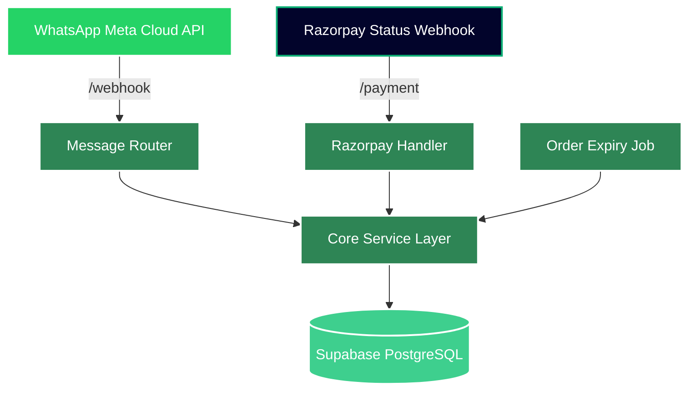
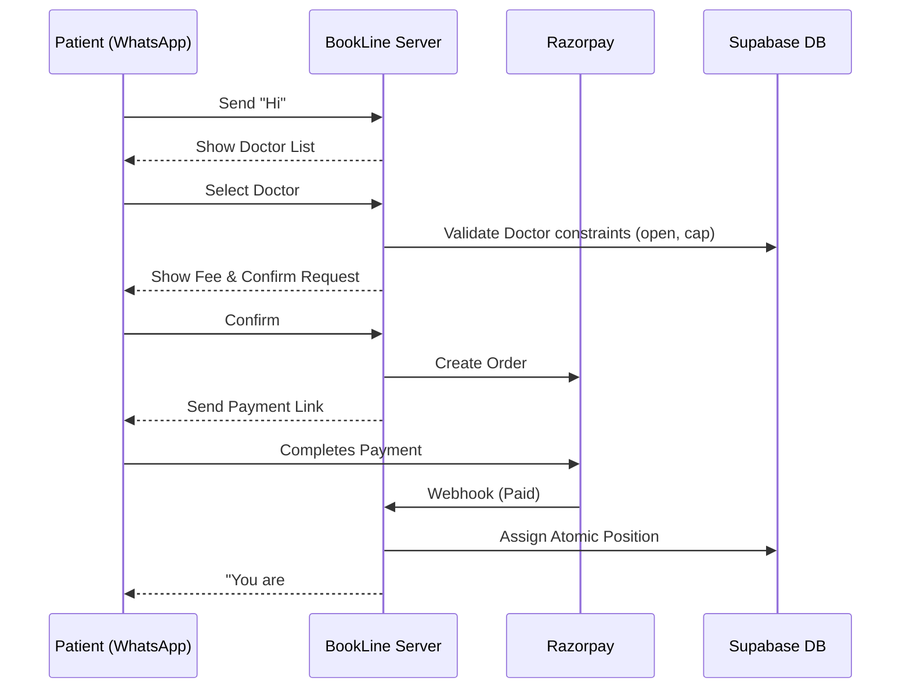

## Overview

BookLine is a production-grade, WhatsApp-first booking engine where patients book doctor appointments via WhatsApp, pay upfront via Razorpay, and receive instant position confirmations. Clinic staff manage everything through WhatsApp admin commands — no web dashboard needed.

## Architecture Diagram



## Component Layers

### 1. Entry Points

<Accordion title="WhatsApp Webhook Endpoint">
  **Route:** `/webhook`
  
  Receives incoming messages from WhatsApp Meta Cloud API. The message router determines the context (patient booking flow, admin commands, etc.) and dispatches to the appropriate handler.
  
  **Events subscribed:** `messages`
</Accordion>

<Accordion title="Razorpay Payment Webhook">
  **Route:** `/payment/webhook`
  
  Receives payment status updates from Razorpay. This is the sole source of truth for payment confirmation.
  
  **Events subscribed:** `payment.captured`, `order.paid`
</Accordion>

<Accordion title="Order Expiry Cron Job">
  Runs periodically to mark unpaid orders as expired using the `expire_stale_orders()` RPC function.
  
  Default expiry window: **10 minutes**
</Accordion>

### 2. Service Layer

The core business logic is organized into specialized services:

| Service | Responsibility |
|---------|----------------|
| **clinicService** | Clinic management, authentication tokens, admin PIN validation |
| **doctorService** | Doctor profiles, config management (fee, cap, window), daily state |
| **orderService** | Order creation, status transitions (pending → paid/expired/refunded) |
| **bookingService** | Position assignment, atomic increment, overflow detection |
| **adminService** | Admin session management, command routing |
| **conversationService** | Multi-step WhatsApp conversation state tracking |
| **settlementService** | Platform fee calculation (5% platform, 95% clinic) |
| **searchService** | Patient booking search across clinics |

<Note>
All services interact with Supabase PostgreSQL using the `@supabase/supabase-js` client.
</Note>

### 3. Database Layer

**Technology:** Supabase (PostgreSQL)

- **8 core tables** for clinic, doctor, order, booking, and session data
- **3 RPC functions** for atomic operations (increment, decrement, expire)
- **Row-Level Security (RLS)** enabled for tenant isolation

See [Database Schema](/architecture/database-schema) for complete details.

## Request Flow

### Patient Booking Flow



### Admin Management Flow

```
Admin sends "ADMIN" → Bot asks for PIN → Session created (10 min)
  → Select doctor → Choose action:
    1. Set Fee       4. Pause Booking
    2. Set Cap       5. Resume Booking
    3. Set Window    6. Close Booking
                     7. View Today's Bookings
```

## Key Design Principles

### 1. Clinic Isolation

Each clinic is identified by its WhatsApp `phone_number_id`. All data (doctors, bookings, sessions) is scoped to the clinic.

<Warning>
Never expose data across clinics. Each clinic has its own access token and admin PIN.
</Warning>

### 2. Payment as Source of Truth

Bookings are only created **after** payment confirmation via Razorpay webhook. Order status transitions are idempotent.

### 3. State Management

- **doctor_configs:** Persistent template (fee, cap, booking window)
- **doctor_daily_states:** Runtime state (current count, status: OPEN/PAUSED/CLOSED)
- **conversation_states:** Multi-step WhatsApp flow context (JSONB)

### 4. No Cancellations

Once paid, bookings are final. The only decrement scenario is overflow rollback with automatic refund.

## Project Structure

```
BookLine/
├── src/
│   ├── config/              # Env, DB, and Payment configuration
│   ├── services/            # Core business logic (Clinics, Doctors, Bookings)
│   ├── handlers/            # Routing incoming WhatsApp messages
│   ├── whatsapp/            # Meta Cloud API integrations
│   ├── routes/              # Express API Webhooks
│   ├── jobs/                # Cron jobs for handling state
│   ├── utils/               # Shared utilities
│   └── server.js            # Express Entry
├── supabase/                # Database schemas & migrations
├── scripts/                 # Seed data scripts
└── README.md
```

## Integration Points

### WhatsApp Meta Cloud API

- **Webhook Verification:** Uses `WHATSAPP_VERIFY_TOKEN`
- **API Version:** `v21.0` (configurable)
- **Message Types:** Text, interactive buttons, lists

### Razorpay

- **Order Creation:** Creates payment orders with 10-minute expiry
- **Webhook Signature:** Verified using `RAZORPAY_WEBHOOK_SECRET`
- **Automatic Refunds:** Triggered on cap overflow

### Supabase

- **Database:** PostgreSQL with UUID primary keys
- **Storage:** Not used (messaging-only system)
- **Auth:** Not used (custom admin PIN auth)
- **Service Role Key:** Required for server-side operations

## Environment Configuration

| Variable | Description |
|----------|-------------|
| `PORT` | Server port (default: 3000) |
| `SUPABASE_URL` | Your Supabase project URL |
| `SUPABASE_SERVICE_ROLE_KEY` | Supabase service role key |
| `WHATSAPP_VERIFY_TOKEN` | Meta webhook verification token |
| `WHATSAPP_API_VERSION` | Meta API version (default: v21.0) |
| `RAZORPAY_KEY_ID` | Razorpay key ID |
| `RAZORPAY_KEY_SECRET` | Razorpay key secret |
| `RAZORPAY_WEBHOOK_SECRET` | Razorpay webhook secret |
| `ORDER_EXPIRY_MINUTES` | Order expiry time (default: 10) |

## Next Steps

<CardGroup cols={2}>
  <Card title="Safety Guarantees" icon="shield" href="/architecture/safety-guarantees">
    Learn about concurrency safety and atomic operations
  </Card>
  <Card title="Database Schema" icon="database" href="/architecture/database-schema">
    Explore the complete database structure
  </Card>
</CardGroup>