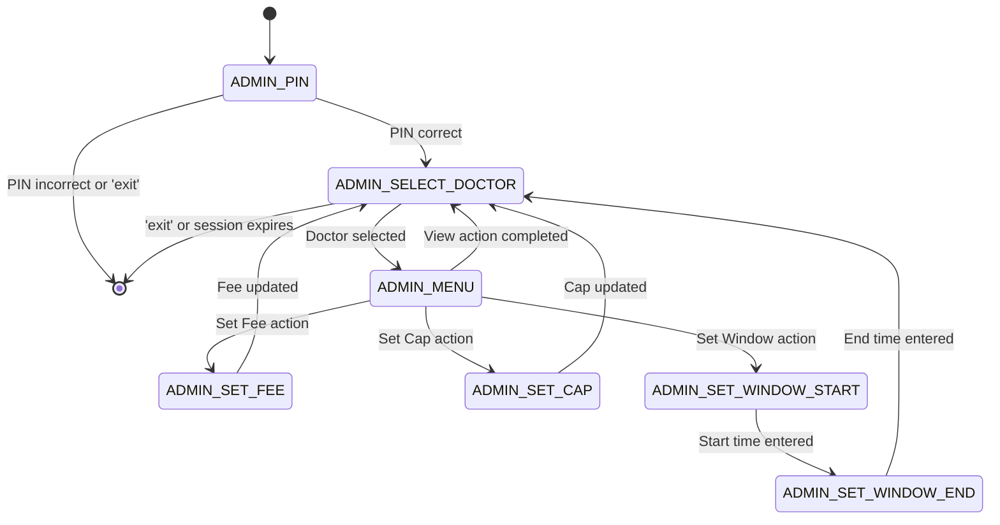

BookLine provides a powerful admin interface accessible entirely through WhatsApp. Clinic administrators can manage doctor configurations, view bookings, and control daily operations without leaving the messaging app.

## Overview

The admin interface is protected by PIN authentication and provides full control over:

<CardGroup cols={2}>
  <Card title="Doctor Management" icon="user-doctor">
    Configure fees, daily caps, and booking windows for each doctor
  </Card>
  <Card title="Status Control" icon="toggle-on">
    Pause, resume, or close bookings in real-time
  </Card>
  <Card title="View Bookings" icon="list">
    See all bookings for any doctor for the current day
  </Card>
  <Card title="Earnings Reports" icon="chart-line">
    Track platform and clinic earnings with settlement details
  </Card>
</CardGroup>

## Getting Started

### Accessing Admin Mode

To access admin mode, send the special trigger command to your clinic's WhatsApp number:

```text
adminxkr
```

<Note>
The admin trigger is defined in `src/handlers/adminHandler.js:21` as `adminxkr`. You can customize this in your deployment.
</Note>

### PIN Authentication

After sending the trigger, BookLine requests your admin PIN:

```text
🔐 Admin Access

Please enter your admin PIN:
```

The PIN is configured per clinic in the `clinics` table:

```sql
-- From supabase/migration.sql:18
admin_pin TEXT NOT NULL DEFAULT '1234'
```

<Warning>
**Change the default PIN** (`1234`) immediately after setup. Update it directly in your Supabase database:
```sql
UPDATE clinics SET admin_pin = 'your-secure-pin' WHERE id = '<clinic-id>';
```
</Warning>

### Session Management

Admin sessions expire after **10 minutes** of inactivity. The session is automatically extended with each command.

```javascript
// From src/handlers/adminHandler.js:109-110
await whatsapp.sendText(phoneNumberId, accessToken, from,
  '✅ Admin access granted!\n\nSession expires in 10 minutes.'
);
```

To exit admin mode manually:

```text
exit
```

## Admin Workflow

<Steps>
  <Step title="Authenticate with PIN">
    Send `adminxkr` and enter your PIN when prompted.
  </Step>

  <Step title="Select a doctor">
    BookLine displays a list of all doctors in your clinic. Select the doctor you want to manage.
    
    ```javascript
    // From src/handlers/adminHandler.js:131-137
    const sections = [{
      title: 'Select Doctor to Manage',
      rows: doctors.map(doc => ({
        id: `admin_doc_${doc.id}`,
        title: doc.name,
      })),
    }];
    ```
  </Step>

  <Step title="Choose an action">
    After selecting a doctor, you'll see their current configuration and available actions:
    
    - 💰 Set Fee
    - 👥 Set Cap
    - ⏰ Set Booking Window
    - ⏸ Pause Bookings
    - ▶️ Resume Bookings
    - 🔒 Close Bookings
    - 📋 View Today's Bookings
    - 💵 View Earnings
  </Step>

  <Step title="Execute action">
    Select an action and follow the prompts to configure settings or view information.
  </Step>

  <Step title="Return to menu or exit">
    After completing an action, you can select another doctor or type `exit` to end the session.
  </Step>
</Steps>

## Admin Actions

### Set Fee

Update the consultation fee for a doctor. The fee is stored in **paise** (1 rupee = 100 paise).

```text
Admin: 💰 Set Fee
Bot: Enter the new consultation fee in rupees (e.g., 500):
Admin: 750
Bot: ✅ Consultation fee updated to ₹750
```

```javascript
// From src/handlers/adminHandler.js:285-295
async handleSetFee(clinic, from, text, context) {
  const fee = parseInt(text, 10);
  if (isNaN(fee) || fee <= 0) {
    await whatsapp.sendText(phoneNumberId, accessToken, from,
      '❌ Invalid amount. Please enter a valid number (e.g., 500).');
    return;
  }
  
  await doctorService.updateConfig(context.doctorId, { fee: fee * 100 });
  await whatsapp.sendText(phoneNumberId, accessToken, from,
    `✅ Consultation fee updated to ${formatAmount(fee * 100)}`);
}
```

<Note>
Fee changes do **not** affect existing pending orders. Orders lock the fee at creation time to prevent price manipulation.
</Note>

### Set Cap

Configure the maximum number of patients a doctor can see per day.

```text
Admin: 👥 Set Cap
Bot: Enter the maximum number of patients per day (e.g., 30):
Admin: 40
Bot: ✅ Daily patient cap set to 40
```

```javascript
// From src/handlers/adminHandler.js:307-317
async handleSetCap(clinic, from, text, context) {
  const cap = parseInt(text, 10);
  if (isNaN(cap) || cap <= 0) {
    await whatsapp.sendText(phoneNumberId, accessToken, from,
      '❌ Invalid number. Please enter a positive integer (e.g., 30).');
    return;
  }
  
  await doctorService.updateConfig(context.doctorId, { max_patients: cap });
  await whatsapp.sendText(phoneNumberId, accessToken, from,
    `✅ Daily patient cap set to ${cap}`);
}
```

### Set Booking Window

Define the time range during which patients can book appointments.

```text
Admin: ⏰ Set Booking Window
Bot: Enter the booking start time in HH:MM format (e.g., 06:00):
Admin: 08:00
Bot: Enter the booking end time in HH:MM format (e.g., 22:00):
Admin: 18:00
Bot: ✅ Booking window set to 08:00 - 18:00
```

The booking window validation is enforced before creating orders:

```javascript
// From src/handlers/patientHandler.js (booking window check)
if (!isWithinBookingWindow(config.booking_start_time, config.booking_end_time, timezone)) {
  await whatsapp.sendText(phoneNumberId, accessToken, from,
    `⏰ Booking window closed\n\n` +
    `${drName(doctor.name)} accepts bookings from ${config.booking_start_time} to ${config.booking_end_time}.\n\n` +
    `Please try again during booking hours.`);
  return;
}
```

### Pause Bookings

Temporarily stop accepting new bookings for a doctor. Existing bookings remain valid.

```text
Admin: ⏸ Pause Bookings
Bot: ⏸ Bookings paused for Dr. [Name]
     The doctor will not appear in patient booking lists until resumed.
```

```javascript
// From src/handlers/adminHandler.js:261
await doctorService.updateDailyState(context.doctorId, todayStr, { status: 'PAUSED' });
```

<Info>
When a doctor is paused, they are **filtered out** of the doctor selection list shown to patients. The pause only affects the current day.
</Info>

### Resume Bookings

Resume accepting bookings after a pause.

```text
Admin: ▶️ Resume Bookings
Bot: ▶️ Bookings resumed for Dr. [Name]
     The doctor is now available for new bookings.
```

```javascript
// From src/handlers/adminHandler.js:267
await doctorService.updateDailyState(context.doctorId, todayStr, { status: 'OPEN' });
```

### Close Bookings

Permanently close bookings for the day. Unlike pause, close is final and cannot be undone.

```text
Admin: 🔒 Close Bookings
Bot: 🔒 Bookings closed for Dr. [Name] for today.
     No more appointments can be made.
```

```javascript
// From src/handlers/adminHandler.js:273
await doctorService.updateDailyState(context.doctorId, todayStr, { status: 'CLOSED' });
```

<Warning>
Closed bookings cannot be reopened. Use **Pause** if you need the flexibility to resume later.
</Warning>

### View Today's Bookings

See all confirmed bookings for a doctor for the current day.

```text
Admin: 📋 View Today's Bookings
Bot: 📋 Bookings for Dr. [Name] - March 4, 2026
     
     1. #1 - +91XXXXX123 - 09:23 AM
     2. #2 - +91XXXXX456 - 09:31 AM
     3. #3 - +91XXXXX789 - 09:45 AM
     
     Total: 3 patients
     Cap: 30 patients
     Status: OPEN
```

```javascript
// From src/handlers/adminHandler.js:282
const bookings = await bookingService.listByDoctorDate(context.doctorId, todayStr);
const formatted = bookings.map((b, i) => 
  `${i + 1}. #${b.position} - ${maskPhone(b.patient_phone)} - ${formatTime(b.created_at, timezone)}`
).join('\n');
```

### View Earnings

Track platform and clinic earnings, including unsettled amounts.

```text
Admin: 💵 View Earnings
Bot: 💵 Earnings Report - Dr. [Name]
     
     Today's Revenue: ₹15,000
     Platform Fee (5%): ₹750
     Clinic Share (95%): ₹14,250
     
     Unsettled Earnings: ₹42,500
     Last Settlement: March 1, 2026
```

The platform takes a **5% fee** on all bookings, with the remaining **95%** going to the clinic:

```javascript
// From src/services/settlementService.js:18-25
calculateSplit(amount) {
  const platformFee = Math.floor(amount * 0.05); // 5%
  const clinicShare = amount - platformFee;      // 95%
  
  return {
    platformFee,
    clinicShare,
    total: amount
  };
}
```

## State Machine

The admin flow uses the following state machine:



## Security Best Practices

<AccordionGroup>
  <Accordion title="Use Strong PINs">
    Never use the default PIN `1234` in production. Use a strong, unique PIN for each clinic:
    ```sql
    UPDATE clinics SET admin_pin = 'your-secure-pin-here' WHERE id = '<clinic-id>';
    ```
  </Accordion>

  <Accordion title="Monitor Admin Sessions">
    Track admin actions by logging conversation state changes:
    ```javascript
    console.log(`[Admin] ${from} executed action: ${action} for doctor: ${doctorId}`);
    ```
  </Accordion>

  <Accordion title="Restrict Admin Phone Numbers">
    Add a whitelist of authorized admin phone numbers in the database:
    ```sql
    ALTER TABLE clinics ADD COLUMN admin_phones TEXT[];
    UPDATE clinics SET admin_phones = ARRAY['+919876543210'] WHERE id = '<clinic-id>';
    ```
    
    Then check before granting access:
    ```javascript
    if (!clinic.admin_phones.includes(from)) {
      await whatsapp.sendText(phoneNumberId, accessToken, from,
        '❌ Unauthorized. This number is not registered as an admin.');
      return;
    }
    ```
  </Accordion>

  <Accordion title="Audit Logs">
    Create an `admin_logs` table to track all configuration changes:
    ```sql
    CREATE TABLE admin_logs (
      id UUID PRIMARY KEY DEFAULT uuid_generate_v4(),
      clinic_id UUID NOT NULL REFERENCES clinics(id),
      admin_phone TEXT NOT NULL,
      action TEXT NOT NULL,
      doctor_id UUID REFERENCES doctors(id),
      old_value JSONB,
      new_value JSONB,
      created_at TIMESTAMPTZ NOT NULL DEFAULT NOW()
    );
    ```
  </Accordion>
</AccordionGroup>

## Troubleshooting

| Issue | Solution |
|-------|----------|
| "Session expired" message | The 10-minute timeout has elapsed. Send `adminxkr` again to re-authenticate. |
| "Invalid PIN" | Check that you're using the correct PIN from the `clinics.admin_pin` column. |
| "No doctors configured" | Add doctors via the Supabase dashboard or seeding script. |
| Actions not responding | Verify the admin session is still active with `adminService.isAuthenticated()`. |
| Fee/cap not updating | Check database permissions for the service role key. |

## Related Documentation

<CardGroup cols={2}>
  <Card title="Patient Flow" icon="users" href="/guides/patient-flow">
    Learn how patients interact with the booking system
  </Card>
  <Card title="Configuration" icon="gear" href="/guides/configuration">
    Complete guide to system configuration
  </Card>
  <Card title="Database Schema" icon="database" href="/architecture/database-schema">
    Understand the admin_sessions and doctor_configs tables
  </Card>
  <Card title="WhatsApp Setup" icon="message" href="/technical/whatsapp-setup">
    Configure your WhatsApp Business API
  </Card>
</CardGroup>
