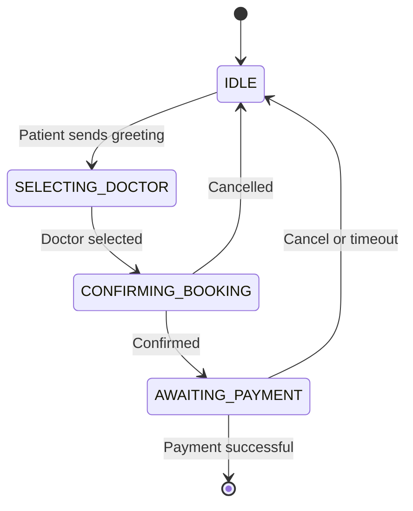

The patient booking flow enables users to discover doctors, make payments, and receive appointment confirmations entirely through WhatsApp.

## Overview

BookLine provides a conversational booking experience where patients interact with your clinic through natural WhatsApp messages. No app installation or website navigation required.

<CardGroup cols={2}>
  <Card title="Conversational Interface" icon="comments">
    Patients interact using natural language and interactive buttons
  </Card>
  <Card title="Prepaid Bookings" icon="credit-card">
    Payment required upfront via Razorpay before position assignment
  </Card>
  <Card title="Instant Confirmation" icon="bolt">
    Atomic position assignment ensures accurate queue numbers
  </Card>
  <Card title="WhatsApp Native" icon="message">
    All interactions happen within the WhatsApp app
  </Card>
</CardGroup>

## Patient Journey

<Steps>
  <Step title="Patient initiates conversation">
    Patient sends any greeting message to your clinic's WhatsApp number:
    ```text
    Hi
    Book appointment
    Hello
    ```
    BookLine responds with a welcome message and displays available doctors in an interactive list.
  </Step>

  <Step title="Doctor selection">
    The patient receives a WhatsApp interactive list showing all active doctors with their:
    - Name
    - Consultation fee
    - Current booking status (OPEN/PAUSED/CLOSED)
    
    <Note>
      Only doctors with status `OPEN` appear in the list. Doctors who are `PAUSED` or `CLOSED` are automatically filtered out.
    </Note>
  </Step>

  <Step title="Booking confirmation">
    After selecting a doctor, the patient receives a confirmation prompt with:
    - Doctor name
    - Consultation fee
    - Booking date (today in clinic timezone)
    - Terms and conditions
    
    The patient taps **Confirm** or **Cancel** buttons.
  </Step>

  <Step title="Payment link generation">
    Once confirmed, BookLine:
    1. Validates the doctor's booking window and capacity
    2. Creates a Razorpay order
    3. Generates a payment link
    4. Sends the link to the patient via WhatsApp
    
    ```javascript
    // From src/handlers/patientHandler.js:185-205
    const order = await razorpay.orders.create({
      amount: fee,
      currency: 'INR',
      notes: {
        clinic_id: clinicId,
        doctor_id: doctorId,
        patient_phone: from,
        date: todayStr
      }
    });
    
    const paymentLink = `https://pages.razorpay.com/pl_${order.id}`;
    await whatsapp.sendText(phoneNumberId, accessToken, from,
      `💳 *Payment Link*\n\n` +
      `Amount: ${formatAmount(fee)}\n` +
      `Doctor: ${drName(doctor.name)}\n\n` +
      `👉 ${paymentLink}\n\n` +
      `Pay within ${env.ORDER_EXPIRY_MINUTES} minutes`
    );
    ```
  </Step>

  <Step title="Payment completion">
    Patient completes payment through Razorpay's secure interface. Razorpay sends a webhook to BookLine when payment succeeds.
  </Step>

  <Step title="Position assignment">
    When the payment webhook arrives, BookLine:
    1. Verifies payment signature
    2. Atomically increments the doctor's daily counter
    3. Assigns the patient a unique position number
    4. Sends confirmation message
    
    ```javascript
    // Atomic position assignment from src/services/bookingService.js
    const { data: incrementResult } = await supabase.rpc('increment_daily_count', {
      p_doctor_id: doctorId,
      p_date: date
    });
    
    const position = incrementResult[0].new_count;
    ```
    
    <Note>
      Position assignment is **atomic** and **concurrency-safe**. Even if multiple patients pay simultaneously, each receives a unique position number with no collisions.
    </Note>
  </Step>

  <Step title="Confirmation message">
    Patient receives their confirmed position:
    ```text
    ✅ Booking Confirmed!

    Doctor: Dr. Sarah Johnson
    Position: #12
    Date: March 4, 2026

    11 patients ahead of you.
    Please arrive early and wait for your turn.
    ```
  </Step>
</Steps>

## State Machine

The patient flow uses a state machine to track conversation progress:



### State Descriptions

| State | Description | Next Actions |
|-------|-------------|--------------|
| `IDLE` | Initial state, no active conversation | Show doctor list on any message |
| `SELECTING_DOCTOR` | Doctor list displayed | Wait for list selection |
| `CONFIRMING_BOOKING` | Doctor selected, awaiting confirmation | Confirm or Cancel |
| `AWAITING_PAYMENT` | Order created, payment link sent | Wait for webhook or cancel |

## Special Commands

Patients can use these special commands at any time:

### View My Bookings

```text
status
my bookings
my booking
```

Returns a list of all bookings for the patient across all doctors in the clinic for today.

### Switch Clinic

```text
change clinic
switch clinic
switch
```

Resets the conversation and allows the patient to select a different clinic (if multi-clinic support is configured).

### Cancel Pending Payment

When in `AWAITING_PAYMENT` state:
```text
cancel
```

Cancels the pending order and returns to `IDLE` state. The order status is set to `expired` and the position counter is **not** incremented.

## Validation Rules

BookLine enforces several validation rules before allowing a booking:

<AccordionGroup>
  <Accordion title="Booking Window Validation">
    The booking must be within the doctor's configured time window:
    ```javascript
    // From src/utils/timezone.js
    const isWithinBookingWindow = (startTime, endTime, timezone) => {
      const now = DateTime.now().setZone(timezone);
      const [startH, startM] = startTime.split(':').map(Number);
      const [endH, endM] = endTime.split(':').map(Number);
      
      const start = now.set({ hour: startH, minute: startM });
      const end = now.set({ hour: endH, minute: endM });
      
      return now >= start && now <= end;
    };
    ```
    
    If outside the window, the patient receives:
    ```text
    ⏰ Booking window closed
    
    Dr. [Name] accepts bookings from 06:00 to 22:00.
    Please try again during booking hours.
    ```
  </Accordion>

  <Accordion title="Capacity Validation">
    After payment, if the doctor has reached their daily cap:
    ```javascript
    if (position > config.max_patients) {
      // Rollback: decrement counter
      await supabase.rpc('decrement_daily_count', {
        p_doctor_id: doctorId,
        p_date: date
      });
      
      // Initiate refund
      await orderService.updateStatus(orderId, 'refunded');
      
      // Notify patient
      await whatsapp.sendText(phoneNumberId, accessToken, from,
        '❌ Sorry, Dr. [Name] has reached capacity for today.\n\n' +
        'Your payment will be refunded within 5-7 business days.'
      );
    }
    ```
  </Accordion>

  <Accordion title="Doctor Status Check">
    Only doctors with `status = 'OPEN'` appear in the list. If a doctor is set to `PAUSED` or `CLOSED` mid-flow, the booking is rejected:
    ```javascript
    const dailyState = await doctorService.getOrCreateDailyState(doctorId, date);
    if (dailyState.status !== 'OPEN') {
      await whatsapp.sendText(phoneNumberId, accessToken, from,
        '⚠️ Dr. [Name] is currently not accepting bookings.\n\n' +
        'Please select another doctor or try again later.'
      );
      return;
    }
    ```
  </Accordion>

  <Accordion title="Order Expiry">
    Orders automatically expire after `ORDER_EXPIRY_MINUTES` (default: 10 minutes). A cron job runs every 2 minutes:
    ```javascript
    // From src/jobs/expiryJob.js
    cron.schedule('*/2 * * * *', async () => {
      const { data: expiredCount } = await supabase.rpc('expire_stale_orders');
      if (expiredCount > 0) {
        console.log(`[ExpiryJob] Expired ${expiredCount} stale orders`);
      }
    });
    ```
    
    Expired orders do **not** increment the position counter.
  </Accordion>
</AccordionGroup>

## Error Handling

BookLine handles errors gracefully and provides clear feedback to patients:

| Error Scenario | Patient Message |
|----------------|-----------------|
| No active doctors | "No doctors available for booking right now. Please contact the clinic." |
| Payment link generation fails | "Unable to generate payment link. Please try again or contact support." |
| Webhook verification fails | (Silent failure, logs error, no position assigned) |
| Database connection error | "Service temporarily unavailable. Please try again in a few minutes." |
| Invalid doctor selection | "Invalid selection. Please choose from the list." |

## Best Practices

<CardGroup cols={2}>
  <Card title="Clear communication" icon="comments">
    Always use clear, concise language in your doctor names and clinic settings
  </Card>
  <Card title="Reasonable caps" icon="gauge-high">
    Set realistic daily caps (typically 20-50 patients per doctor)
  </Card>
  <Card title="Appropriate windows" icon="clock">
    Configure booking windows that match actual clinic hours
  </Card>
  <Card title="Monitor webhooks" icon="chart-line">
    Regularly check webhook logs to catch payment processing issues
  </Card>
</CardGroup>

## Related Documentation

<Card title="Admin Flow" icon="shield-halved" href="/guides/admin-flow">
  Learn how admins manage doctor settings and bookings
</Card>

<Card title="Safety Guarantees" icon="lock" href="/architecture/safety-guarantees">
  Understand how BookLine prevents race conditions and double bookings
</Card>

<Card title="Razorpay Setup" icon="credit-card" href="/technical/razorpay-setup">
  Configure Razorpay for payment processing
</Card>
