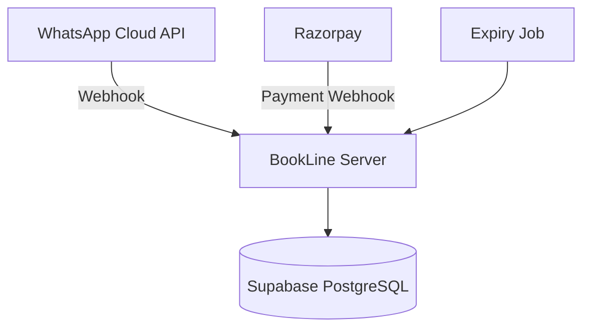

# Welcome to BookLine

BookLine is a production-grade, WhatsApp-first booking engine where patients book doctor appointments via WhatsApp, pay upfront via Razorpay, and receive instant position confirmations. Clinic staff manage everything through WhatsApp admin commands — no web dashboard needed.

## What is BookLine?

BookLine transforms the traditional clinic booking experience by leveraging WhatsApp's ubiquitous reach and familiar interface. Instead of phone calls, web forms, or mobile apps, patients simply send a message to book appointments and receive their queue position instantly after payment.

## Key Features

<CardGroup cols={2}>
  <Card title="WhatsApp-First" icon="whatsapp">
    Entire booking flow happens in WhatsApp - from discovery to payment to confirmation
  </Card>
  <Card title="Prepaid Bookings" icon="credit-card">
    Razorpay integration ensures payment before position assignment
  </Card>
  <Card title="Admin on WhatsApp" icon="user-shield">
    Clinic staff manage fees, caps, and schedules directly via WhatsApp commands
  </Card>
  <Card title="Atomic Position Assignment" icon="list-ol">
    Concurrency-safe queue management ensures no double-bookings
  </Card>
</CardGroup>

## How It Works

<Steps>
  <Step title="Patient Discovery">
    Patient sends "Hi" or searches for a doctor/clinic name. BookLine uses fuzzy search to find matches across all registered clinics and doctors.
  </Step>
  <Step title="Doctor Selection">
    Patient selects a doctor from the list. BookLine displays the fee and booking details.
  </Step>
  <Step title="Payment">
    Patient confirms and receives a Razorpay payment link. Order expires in 10 minutes if unpaid.
  </Step>
  <Step title="Position Assignment">
    Upon successful payment, BookLine atomically assigns the next queue position and sends confirmation via WhatsApp.
  </Step>
</Steps>

## Architecture

BookLine is built on three core integrations:



### Components

- **WhatsApp Cloud API**: Handles all message routing and interactive UI (lists, buttons)
- **Razorpay**: Processes payments and sends webhook confirmations
- **Supabase**: PostgreSQL database with atomic RPCs for position assignment
- **Express Server**: Routes webhooks and manages business logic
- **Cron Jobs**: Expires stale pending orders

## Patient Flow

<CodeGroup>
```text Patient Journey
1. Patient: "Hi"
   → Bot: Shows doctor list

2. Patient: Selects "Dr. Smith"
   → Bot: "Dr. Smith - Fee: ₹500. Confirm?"

3. Patient: "Yes"
   → Bot: Creates order, sends payment link

4. Patient: Completes payment
   → Bot: "✅ Booking Confirmed. Token: #12"
```

```text Admin Journey
1. Admin: "adminxkr"
   → Bot: "Enter PIN"

2. Admin: "1234"
   → Bot: Shows doctor selection menu

3. Admin: Selects doctor
   → Bot: Shows admin actions (Set Fee, Cap, etc.)

4. Admin: "Set Fee"
   → Bot: "Enter new fee in rupees"

5. Admin: "600"
   → Bot: "✅ Fee updated to ₹600"
```
</CodeGroup>

## Safety Guarantees

BookLine is designed for high-concurrency scenarios where multiple patients may be booking simultaneously:

<AccordionGroup>
  <Accordion title="Concurrency-Safe Position Assignment">
    Uses Supabase RPC functions with PostgreSQL row-level locking to atomically increment the queue counter. No two bookings can receive the same position.
  </Accordion>
  
  <Accordion title="Payment-Safe State Transitions">
    Webhooks are the sole source of truth. Orders can only transition from `pending` → `paid` once, ensuring idempotent processing even with duplicate webhooks.
  </Accordion>
  
  <Accordion title="Cap-Safe Overflow Handling">
    When a doctor's capacity is exceeded, the system automatically:
    1. Detects overflow after atomic increment
    2. Rolls back the counter
    3. Initiates Razorpay refund
    4. Notifies patient via WhatsApp
  </Accordion>
  
  <Accordion title="No Double-Booking">
    Unique constraint on `bookings.order_id` prevents the same order from creating multiple bookings, even in race conditions.
  </Accordion>
</AccordionGroup>

## Use Cases

BookLine is ideal for:

- **Private Clinics**: Single or multi-doctor practices wanting to reduce phone call volume
- **Diagnostic Centers**: Labs offering appointment-based sample collection
- **Dental Practices**: Managing daily patient flow with prepaid slots
- **Specialty Clinics**: Dermatology, physiotherapy, or any outpatient service

<Note>
  **Multi-Clinic Support**: BookLine supports multiple independent clinics on a single deployment. Each clinic gets its own WhatsApp number and operates in isolation.
</Note>

## Technology Stack

- **Runtime**: Node.js 18+
- **Framework**: Express.js 5
- **Database**: Supabase (PostgreSQL)
- **Payments**: Razorpay
- **Messaging**: Meta WhatsApp Cloud API (v21.0)
- **Scheduling**: node-cron
- **Search**: Fuse.js (fuzzy search)

## What's Next?

<CardGroup cols={2}>
  <Card title="Quick Start" icon="rocket" href="/quickstart">
    Get BookLine running in under 10 minutes
  </Card>
  <Card title="Detailed Setup" icon="wrench" href="/setup">
    Complete configuration guide for production deployment
  </Card>
</CardGroup>
