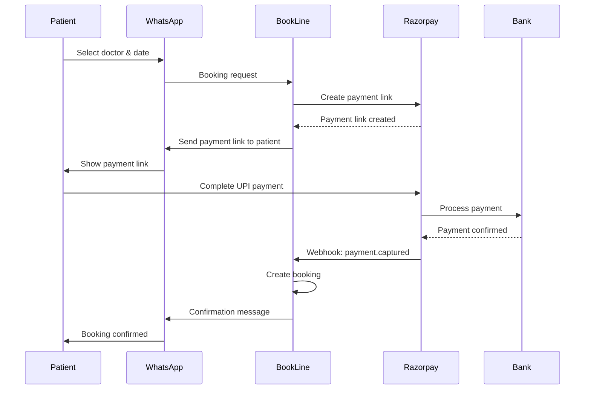

BookLine uses Razorpay to process prepaid booking fees via UPI payment links and QR codes. This guide covers account setup, API configuration, and webhook integration.

## Prerequisites

<CardGroup cols={2}>
  <Card title="Razorpay Account" icon="credit-card">
    Sign up at [razorpay.com](https://razorpay.com)
  </Card>
  
  <Card title="Business KYC" icon="building">
    Complete business verification to go live
  </Card>
  
  <Card title="Bank Account" icon="bank">
    For receiving settlements
  </Card>
  
  <Card title="Public Webhook URL" icon="globe">
    HTTPS endpoint for payment notifications
  </Card>
</CardGroup>

## Step 1: Get API Credentials

<Steps>
  <Step title="Access API Keys">
    In Razorpay Dashboard:
    - Go to **Settings → API Keys**
    - Click **Generate Test Key** (for development)
    - Or **Generate Live Key** (for production)
  </Step>

  <Step title="Copy credentials">
    You'll receive:
    - **Key ID**: `rzp_test_xxxxxxxxxx` or `rzp_live_xxxxxxxxxx`
    - **Key Secret**: `xxxxxxxxxxxxxxxxxxxxx` (shown once, store securely)
  </Step>

  <Step title="Add to environment">
    Update your `.env` file:
    
    ```bash .env
    RAZORPAY_KEY_ID=rzp_test_xxxxxxxxxx
    RAZORPAY_KEY_SECRET=xxxxxxxxxxxxxxxxxxxxx
    ```
  </Step>
</Steps>

<Warning>
  Never commit API secrets to version control. Use environment variables and keep `.env` in `.gitignore`.
</Warning>

## Step 2: Configure Razorpay Client

BookLine initializes the Razorpay SDK with your credentials:

```javascript src/config/razorpay.js
const Razorpay = require('razorpay');
const env = require('./env');

const razorpay = new Razorpay({
    key_id: env.RAZORPAY_KEY_ID,
    key_secret: env.RAZORPAY_KEY_SECRET,
});

module.exports = razorpay;
```

This client is used throughout the application for:
- Creating payment links
- Generating QR codes
- Processing refunds
- Fetching payment details

## Step 3: Configure Webhook

Webhooks are critical for payment confirmation. Razorpay notifies BookLine when payments succeed.

<Steps>
  <Step title="Create webhook in Razorpay Dashboard">
    Go to **Settings → Webhooks** and click **Create New Webhook**:
    
    - **Webhook URL**: `https://yourdomain.com/payment/webhook`
    - **Secret**: Generate a random string (e.g., `whsec_xxxxxxxxxx`)
    - **Alert Email**: Your email for webhook failures
  </Step>

  <Step title="Subscribe to events">
    Enable these event types:
    - ✅ `payment.captured` - Standard payment success
    - ✅ `order.paid` - Order payment confirmation
    - ✅ `payment_link.paid` - Payment link completion
    - ✅ `qr_code.credited` - UPI QR code payment
  </Step>

  <Step title="Add webhook secret to environment">
    ```bash .env
    RAZORPAY_WEBHOOK_SECRET=whsec_xxxxxxxxxx
    ```
  </Step>

  <Step title="Verify webhook setup">
    Click **Send Test Webhook** to verify your endpoint is working.
  </Step>
</Steps>

## Webhook Signature Verification

BookLine verifies all webhook requests using HMAC SHA256:

```javascript src/routes/payment.js:23-37
const signature = req.headers['x-razorpay-signature'];
const rawBody = Buffer.isBuffer(req.body) 
    ? req.body.toString('utf8') 
    : (typeof req.body === 'string' ? req.body : JSON.stringify(req.body));

const expectedSignature = crypto
    .createHmac('sha256', env.RAZORPAY_WEBHOOK_SECRET)
    .update(rawBody)
    .digest('hex');

if (signature !== expectedSignature) {
    console.warn('[Payment] ❌ Invalid webhook signature');
    return res.status(400).json({ error: 'Invalid signature' });
}
```

<Note>
  Signature verification prevents fraudulent payment confirmations. Always validate before processing payments.
</Note>

## Payment Event Processing

BookLine handles multiple Razorpay event types:

```javascript src/routes/payment.js:40-68
const event = JSON.parse(rawBody);
const eventType = event.event;

// Only process successful payment events
if (eventType !== 'payment.captured' && eventType !== 'order.paid'
    && eventType !== 'payment_link.paid' && eventType !== 'qr_code.credited') {
    return res.status(200).json({ status: 'ignored' });
}

// Extract payment details based on event type
let gatewayOrderId;
let paymentId;
let orderId; // internal order ID (from QR notes)

if (eventType === 'payment_link.paid') {
    gatewayOrderId = event.payload?.payment_link?.entity?.id;
    paymentId = event.payload?.payment?.entity?.id;
} else if (eventType === 'qr_code.credited') {
    // QR payments: find order via notes
    paymentId = event.payload?.payment?.entity?.id;
    orderId = event.payload?.qr_code?.entity?.notes?.order_id;
} else if (eventType === 'payment.captured') {
    gatewayOrderId = event.payload?.payment?.entity?.notes?.payment_link_id
        || event.payload?.payment?.entity?.order_id;
    paymentId = event.payload?.payment?.entity?.id;
}
```

### Event Types

<ParamField path="payment.captured" type="event">
  Triggered when a payment is successfully captured. Contains payment ID and order details.
</ParamField>

<ParamField path="order.paid" type="event">
  Triggered when an order is marked as paid. Includes order and payment entities.
</ParamField>

<ParamField path="payment_link.paid" type="event">
  Triggered when a payment link is successfully paid. Used for dynamic UPI links.
</ParamField>

<ParamField path="qr_code.credited" type="event">
  Triggered when a static QR code receives payment. Order ID is extracted from QR notes.
</ParamField>

## Idempotency and Duplicate Prevention

Razorpay may send duplicate webhooks. BookLine uses optimistic concurrency control:

```javascript src/routes/payment.js:89-101
// Only process if order status is 'pending'
if (order.status !== 'pending') {
    console.log(`[Payment] Order already processed (status: ${order.status})`);
    return res.status(200).json({ status: 'already_processed' });
}

// Atomic status update with concurrency check
const updatedOrder = await orderService.updateStatus(order.id, 'pending', 'paid');
if (!updatedOrder) {
    // Another webhook already processed this
    console.log(`[Payment] Concurrent processing — skipping`);
    return res.status(200).json({ status: 'concurrent_skip' });
}
```

<Warning>
  Always implement idempotency checks. Multiple webhooks for the same payment can cause duplicate bookings or credits.
</Warning>

## Refund Processing

When booking capacity is exceeded after payment, BookLine automatically refunds:

```javascript src/routes/payment.js:154-172
if (result.refundRequired) {
    console.warn(`[Payment] CAP EXCEEDED — initiating refund`);

    // Mark order as refunded
    await orderService.updateStatus(order.id, 'paid', 'refunded');

    // Trigger Razorpay refund
    try {
        if (paymentId) {
            await razorpay.payments.refund(paymentId, {
                amount: order.amount,
                speed: 'normal',
                notes: { reason: 'cap_exceeded_overflow' },
            });
        }
    } catch (refundErr) {
        console.error('[Payment] Refund error:', refundErr.message);
    }

    // Notify patient
    await whatsapp.sendText(phoneNumberId, accessToken, order.patient_phone,
        `*Slots Full*\n\nAll slots have been filled.\n\nYour payment of *${formatAmount(order.amount)}* will be refunded within 5-7 business days.`);
}
```

## Testing Payment Integration

### Test Mode

Razorpay provides test mode for development:

<Steps>
  <Step title="Use test credentials">
    ```bash .env
    RAZORPAY_KEY_ID=rzp_test_xxxxxxxxxx
    RAZORPAY_KEY_SECRET=test_xxxxxxxxxx
    ```
  </Step>

  <Step title="Use test payment methods">
    Razorpay test mode accepts:
    - **UPI ID**: `success@razorpay`
    - **Card**: 4111 1111 1111 1111 (any CVV, future expiry)
  </Step>

  <Step title="Trigger test webhook">
    In Razorpay Dashboard → Webhooks → Send Test Webhook
  </Step>
</Steps>

### Manual Testing

<CodeGroup>
```bash Create Payment Link (Test)
curl -u rzp_test_xxxxxxxxxx:test_secret_xxxxxxxxxx \
  -X POST https://api.razorpay.com/v1/payment_links \
  -H "Content-Type: application/json" \
  -d '{
    "amount": 50000,
    "currency": "INR",
    "description": "Booking Fee - Dr. Sharma",
    "customer": {
      "contact": "+919876543210"
    },
    "notify": {
      "sms": true,
      "whatsapp": false
    },
    "callback_url": "https://yourdomain.com/payment/success",
    "callback_method": "get"
  }'
```

```json Success Response
{
  "id": "plink_xxxxxxxxxxxxx",
  "short_url": "https://rzp.io/l/xxxxxxx",
  "amount": 50000,
  "currency": "INR",
  "status": "created",
  "description": "Booking Fee - Dr. Sharma",
  "customer": {
    "contact": "+919876543210"
  }
}
```
</CodeGroup>

### Test Payment Scenarios

<AccordionGroup>
  <Accordion title="Successful payment">
    1. Create payment link via BookLine
    2. Open link and pay with `success@razorpay` UPI ID
    3. Check webhook logs for `payment.captured` event
    4. Verify booking created with status `confirmed`
  </Accordion>

  <Accordion title="Failed payment">
    1. Create payment link
    2. Pay with `failure@razorpay` UPI ID
    3. Verify order remains in `pending` status
    4. Check order expiry after `ORDER_EXPIRY_MINUTES`
  </Accordion>

  <Accordion title="Refund scenario">
    1. Create booking when slots are at capacity
    2. Complete payment
    3. Webhook triggers refund automatically
    4. Check Razorpay dashboard for refund entry
    5. Verify patient receives refund notification
  </Accordion>

  <Accordion title="Duplicate webhook">
    1. Complete payment
    2. Send test webhook twice for same payment
    3. Verify only one booking is created
    4. Second webhook should return `already_processed`
  </Accordion>
</AccordionGroup>

## Production Checklist

<Steps>
  <Step title="Complete business verification">
    Submit KYC documents in Razorpay Dashboard to activate live mode
  </Step>

  <Step title="Switch to live credentials">
    ```bash .env
    RAZORPAY_KEY_ID=rzp_live_xxxxxxxxxx
    RAZORPAY_KEY_SECRET=live_xxxxxxxxxx
    ```
  </Step>

  <Step title="Update webhook URL">
    Change webhook URL to production domain (remove ngrok/test URLs)
  </Step>

  <Step title="Configure settlement schedule">
    Set up automatic bank settlements in Razorpay Settings
  </Step>

  <Step title="Enable payment notifications">
    Configure SMS/email notifications for customers in Razorpay Settings
  </Step>

  <Step title="Test refund flow">
    Verify refunds work correctly in live mode with real bank accounts
  </Step>

  <Step title="Set up monitoring">
    - Monitor webhook delivery rate
    - Track payment success/failure rates
    - Alert on refund spikes
  </Step>
</Steps>

## Common Issues

<AccordionGroup>
  <Accordion title="Authentication failed error">
    **Cause**: Incorrect API key or secret
    
    **Solution**:
    - Verify `RAZORPAY_KEY_ID` and `RAZORPAY_KEY_SECRET` match dashboard
    - Ensure using correct environment (test vs live)
    - Check for extra whitespace in environment variables
  </Accordion>

  <Accordion title="Webhook signature mismatch">
    **Cause**: Incorrect webhook secret or body parsing
    
    **Solution**:
    - Verify `RAZORPAY_WEBHOOK_SECRET` matches dashboard
    - Use raw body parser: `express.raw({type: 'application/json'})`
    - Check webhook secret hasn't been rotated
  </Accordion>

  <Accordion title="Payment link not created">
    **Cause**: Invalid amount or missing required fields
    
    **Solution**:
    - Amount must be in paise (₹500 = 50000 paise)
    - Include valid customer contact number
    - Check Razorpay dashboard for error details
  </Accordion>

  <Accordion title="Refund fails">
    **Cause**: Payment not yet settled or invalid payment ID
    
    **Solution**:
    - Verify payment ID exists and is captured
    - Check payment status in Razorpay dashboard
    - Ensure sufficient balance if instant refund
  </Accordion>

  <Accordion title="Duplicate bookings created">
    **Cause**: Missing idempotency checks
    
    **Solution**:
    - Implement order status checks before processing
    - Use optimistic concurrency control
    - Return 200 OK for duplicate webhooks
  </Accordion>
</AccordionGroup>

## Payment Flow Overview



## Next Steps

<CardGroup cols={2}>
  <Card title="Webhook Configuration" icon="webhook" href="/technical/webhooks">
    Deep dive into webhook setup and testing
  </Card>
  
  <Card title="WhatsApp Setup" icon="message" href="/technical/whatsapp-setup">
    Configure WhatsApp Cloud API
  </Card>
  
  <Card title="Environment Variables" icon="key" href="/technical/environment-variables">
    Complete environment configuration reference
  </Card>
  
  <Card title="Payment Flow" icon="money-bill" href="/guides/patient-flow">
    Understand end-to-end booking flow
  </Card>
</CardGroup>